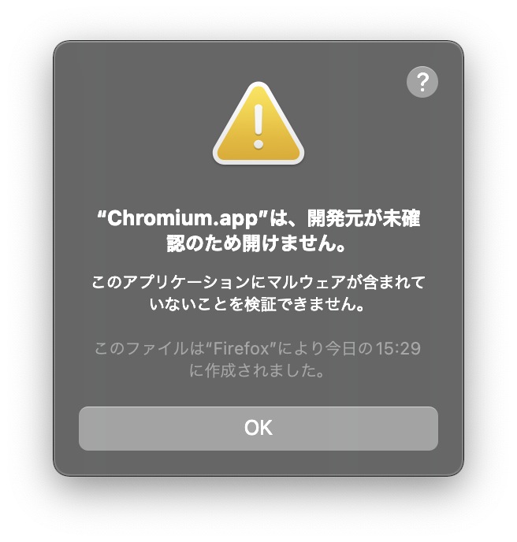

# 署名が不正なアプリが実行できない

## 発生する問題

Mac には Gatekeeper というセキュリティシステムが存在します。

参考: [Mac で App を安全に開く(Apple 公式の説明)](https://support.apple.com/ja-jp/HT202491)

"Gatekeeper" を日本語に直すと、「門番」となります。
この門番が怪しいアプリの実行を拒否して、ウイルスとかから Mac を守ってくれているのですね。

そんなことはともかく、全然怪しくないアプリでも署名が不正なせいで実行できないアプリがあります。
例えば、 [Blender](https://www.blender.org/) や [Chromium](https://www.chromium.org/) などがあります。
これらを実行したいというときでも Gatekeeper は厳しく取り締まってくるので使うことができず、以下のような表示が出ます。



これでは困りますね。なので、この Gatekeeper を回避します。

## 解決法 1 (推奨)

以下のコマンドを実行します。
開きたいアプリが `~/Downloads/Chromium/Chromium.app` の場合、

```bash
xattr -drs com.apple.quarantine ~/Downloads/Chromium/Chromium.app
```

これを実行すると、署名が不正なアプリでも実行できるようになります。

### 原理

Gatekeeper は、ファイルやフォルダの `com.apple.quarantine` 属性をみて、その署名が無効かどうかを判断します。

`xattr`コマンドはファイルなどの属性を操作できるコマンドで、`-d` オプションを付けると属性を削除できます。

なので、上のコマンドを実行すると、対象ファイルの `com.apple.quarantine` 属性が削除され、署名が無効ではないことになります。

### エイリアス設定

以下のように alias を設定すると楽になります。

alias 設定の例

```bash
alias bribe="xattr -drs $1"
```

使用例

```bash
bribe ~/Downloads/Chromium/Chromium.app
```

## 解決法 2 (非推奨)

ターミナルから実行したい**実行ファイル**を実行することで一部の Gatekeeper チェックを回避できます。
`~/Applications/Blender.app`を開きたい場合は、ターミナルで以下のように実行します。

```bash
~/Applications/Blender.app/Contents/MacOS/Blender
```

すると、Gatekeeper のチェックを挟まずに Blender を起動できますが、ターミナルを終了してしまうと Blender も終了してしまったり、なんかダサいのでお勧めしません。
